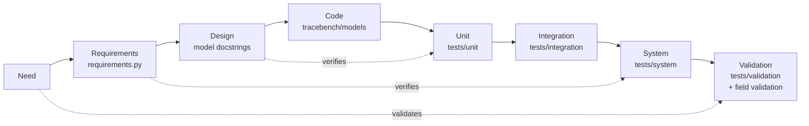

# tracebench

**Verification and validation (V&V) of statistical models, end to end: requirements,
tests at every level of the V-model, known truth validation, field validation on
1.4 million real data points, A/B tests, and a traceability matrix that ties every
requirement to its evidence.**

This is an engineering project about how to prove a model driven system is built
right and is the right system. The test bed is live US equity market data. It was
chosen because it streams at high volume in real time and every prediction's
outcome can be observed a few minutes later, which is exactly what V&V needs.
The subject is the same for sensor, fleet or telemetry data: the models, the
pipeline and the evidence.

> **Not financial advice.** This repository places no orders, contains no strategy
> and makes no performance claims. It is provided as is, with no liability for any
> use. See [DISCLAIMER.md](DISCLAIMER.md).

```bash
pip install -e ".[test]"
python -m tracebench.report        # about 20 seconds
```
```
tracebench: PASS  (reports in reports/)
```

## At a glance

| | |
|:--|:--|
| Requirements | 27, each traced to passing evidence, checked automatically ([traceability](reports/TRACEABILITY.md)) |
| Tests | 90 across unit, integration, system and validation levels; the same run in CI on every push |
| Known truth validation | 400,000+ simulated bars, 16,000 simulated levels, 16,000 distribution fits, every build |
| Field validation | 1,398,672 real one minute bars, 1,510 sessions, 507,080 graded predictions ([07](docs/07-field-validation.md)) |
| A/B test | held out months, 93,800 paired predictions, session cluster bootstrap: calibration error 0.045 → 0.020 |
| Source system | a live pipeline that captured 84 million tick events and 58.7 million one minute bars ([08](docs/08-data-pipeline.md)) |

## What the process found

Every model first passed checks against its own formulas. Validation then found four things: three defects,
each a requirement the code, the design or the model failed to meet, and the measured limits of the model's assumptions.

| Finding | Type | How it was found | Outcome |
|:--|:--|:--|:--|
| **TB-1** The tail model returned the tail shape with the wrong sign; every heavy tail read as bounded. | Defect: code | Parameter recovery on samples with a known shape: bias grew with the true value and never shrank with more data. | Fixed; regression tests keep it fixed |
| **KI-1** The strengthening signal labelled 19 to 27% of *unchanged* levels as strengthening. | Defect: design (fails S-5) | Operating characteristic on simulated levels with a known break rate | Threshold 0.75 → 0.95 (CR-1), cost in power reported |
| **KI-2** On real data the touch model overpredicted by 5.2 points (ECE 0.052 against a 0.03 requirement). | Defect: model on real data (fails R-4) | Field validation, then a split by time of day | Intraday volatility seasonality; fixed by CR-2, chosen by a held out A/B test |
| Measured limits: +4 points on coarse bars, +3 points under clustered volatility | Limits (not defects) | Calibration with each assumption broken on purpose | Documented; flagged at run time |

Details: [issue register](docs/05-issue-register.md) · [validation report](reports/VALIDATION_REPORT.md) · [field validation](docs/07-field-validation.md)

## The V-model, mapped to this repository



## The three models

| Model | Question | Method |
|:--|:--|:--|
| **R** touch | Will the value reach this level within the next N steps? | Reflection principle for a driftless random walk, realized volatility, empirical Bayes blend, intraday seasonality (CR-2) |
| **S** strength | Is this level getting stronger or weaker? | Beta-Binomial posteriors, Monte Carlo comparison |
| **M** magnitude | How far can an excursion run? | Peaks over threshold, Generalized Pareto fit by the method of moments |

The models are small on purpose. The subject is the process around them.

## Read in this order

1. [The V-model and the vocabulary](docs/01-v-model.md)
2. [Requirements](docs/02-requirements.md) (generated from `tracebench/requirements.py`)
3. [Test plan](docs/03-test-plan.md): levels, techniques, entry and exit criteria
4. [Validation method](docs/04-validation-method.md): ground truth, calibration, operating characteristics
5. [Issue register](docs/05-issue-register.md): defects, known issues, changes
6. [Lessons from the original system](docs/06-lessons-from-the-original.md): what worked and what failed, live
7. [Field validation and the A/B test](docs/07-field-validation.md)
8. [The data pipeline](docs/08-data-pipeline.md): volumes, granularities, design decisions and why
9. [Analysis at scale](docs/09-analysis-scale-and-methods.md): data analysed, features per model, methods, metrics, A/B tests
10. The generated evidence in [reports/](reports/)

## Techniques you can lift into your own project

1. **Requirements as data.** One registry; docs and the matrix are generated from it.
2. **A `req` marker on every test**, and a check that fails when a requirement has no test or a test has no requirement.
3. **Known truth validation before field validation**: simulate what you can control, then measure what reality does.
4. **Metamorphic and control tests**: transform the input in a known way and check the output; prove a test can fail.
5. **Held out, paired, cluster bootstrapped A/B tests** for model changes.
6. **Known issues as strict expected failures**, so deviations are recorded, visible, and cannot go stale.
7. **Three verdicts, not two**: PASS, FAIL, and ENVIRONMENT ERROR when the check itself could not run.

## Run it on your own data

```bash
python -m tracebench.calibrate examples/sample_bars.csv          # one series
python -m tracebench.field path/to/bars --split-month 6          # sessions, baseline and A/B
```

Columns: `timestamp_ms, open, high, low, close[, volume]`, CSV or Parquet (Parquet needs `pyarrow`).

## Layout

```
tracebench/          loader, touch definition, models, replay, evaluation, seasonality,
                     requirements registry, traceability, report and field runners
tests/unit|integration|system|validation
docs/                the method, one topic per file
reports/             generated evidence (test report, traceability, validation)
examples/            a sample bar file
.github/workflows/   the same run on every push
```

Requires Python 3.10+ and numpy. Built with an AI pair programmer (Claude Code); the
requirements, the validation design and the conclusions were reviewed by the author.

MIT licence.
