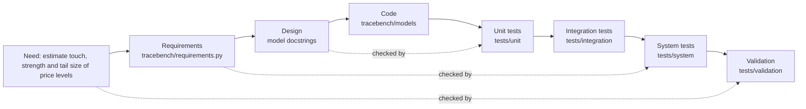

# 1. Verification, validation, and the V-model

## Two questions

| | Verification | Validation |
|:--|:--|:--|
| The question | Did we build the thing right? | Did we build the right thing? |
| Checked against | The requirements and the design | The real need, on realistic data |
| Typical evidence | Unit and integration tests, reviews, static checks | Calibration, known truth studies, field data |
| A failure means | The code does not do what the spec says | The spec (or model) does not do what the world needs |

A model can pass every verification test and still be wrong about the world. The
magnitude model in this repository is the example: its formula was implemented
exactly as written, and every unit test on its algebra passed. Only validation,
fitting data whose true answer was known, showed that the formula itself had the
wrong sign (defect TB-1, see [05-issue-register.md](05-issue-register.md)).

## The V-model

The left side of the V goes from need to code, each step more detailed. The right
side climbs back up, and each level of testing checks the matching level on the
left.

| Level | What it tests | In this repository |
|:--|:--|:--|
| Unit | One function alone | Closed-form probability, conjugate update, survival function, loader rules |
| Integration | Parts working together | Loader on a real file, replay with the model, no lookahead |
| System | The whole run as a user runs it | `python -m tracebench.report`, honest verdicts, reproducibility, traceability |
| Validation | The right model | Calibration on known truth markets, false alarm rate, parameter recovery |

## Words used throughout

1. **Requirement.** A statement a test can decide. "Should be accurate" is not one;
   "expected calibration error at most 0.03" is.
2. **Test case.** One check of one requirement, with a clear pass or fail.
3. **Traceability.** The link from each requirement to the tests that verify it,
   and from each test back to its requirement. It answers two audit questions:
   is every requirement tested, and does every test have a reason to exist?
4. **Ground truth.** The correct answer, known in advance. Simulated scenarios
   provide it; real data usually does not.
5. **Calibration.** A probability model is calibrated when events it calls 30%
   likely happen about 30% of the time.
6. **Operating characteristic.** For a yes or no signal: how often it fires when it
   should not (false alarm) and how often it fires when it should (power), as the
   amount of evidence grows.
7. **Regression test.** A test that keeps a fixed defect fixed.
8. **Known issue (deviation, waiver).** A requirement the system is known not to
   meet, recorded with an id and a reason instead of hidden. Here it is an
   expected failure (`xfail`) so the suite stays green and the deviation stays visible.
9. **Change request.** A recorded design change, with the evidence that motivated it.
10. **Gate.** An automatic check that decides whether a change may proceed. A gate
    that could not run must say so, not report a result it never measured.
