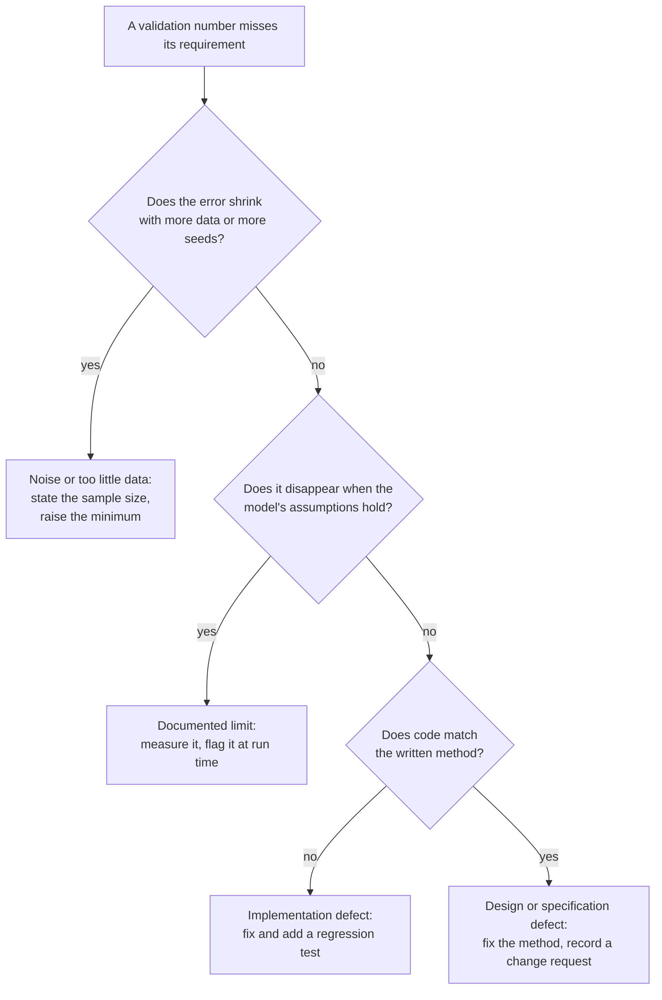

# 4. Validation method

Verification can be done with the code alone. Validation needs an answer key.
Real market data does not come with one: nobody knows what the true volatility
or the true tail shape was. So each model is first validated where the truth is
set by us, and only then used on real data, where the report states which of its
assumptions the data violates.

## How a finding is classified

TB-1 went down the right hand path to the bottom: the code matched the formula, the
error did not shrink with data, and it was present even when every assumption held,
so the formula itself was wrong.

## Model R, touch probability

1. **Scenario.** A driftless random walk in log price with a chosen per bar
   volatility, observed 16 times per bar so highs and lows are nearly continuous.
2. **Replay.** At every 25th bar the model estimates volatility from the previous
   300 bars only, predicts the chance of touching levels placed from 0.25 to 2.5
   expected moves away, and the outcome is graded from the next 30 bars.
3. **Measure.** Calibration: group predictions into 10 bins, compare the mean
   prediction with the observed frequency. Summaries: Brier score and expected
   calibration error (ECE).
4. **Stress.** Repeat with each assumption broken on purpose: one observation per
   bar (coarse monitoring), GARCH volatility clustering, and fat tailed Student-t
   returns. A good validation does not only show where a model works; it measures
   how much it is off where it does not (R-5).
5. **Assumption checks.** Check that the kurtosis and clustering diagnostics flag
   the broken scenarios and stay quiet on clean data (R-6). Their flag levels come
   from this study, not from a guess.

Why thresholds are what they are: ECE of 0.03 is about a third of the spread
between neighbouring calibration bins, small enough that a user reading "40%"
is not misled, and it is met with a margin on every seed.

## Model S, strengthening signal

1. **Scenario.** Simulated sequences of level tests with a known break rate in each
   half: unchanged (0.5 then 0.5) for false alarms, falling (0.6 then 0.3) for power.
2. **Measure.** The share of sequences labelled "strengthening", with its standard
   error, at 8, 16, 32 and 64 tests.
3. **Decision.** The requirement (S-5) caps false alarms at 10 percent. The
   inherited threshold failed it; the report shows both thresholds side by side so
   the cost of the change (less power on small samples) is visible (S-6).

## Model M, tail size

1. **Scenario.** Samples from a Generalized Pareto Distribution with known shape
   xi and scale.
2. **Measure.** Parameter recovery: bias (average error) and RMSE (typical error)
   over 500 fits per cell, for several true xi and sample sizes.
3. **What to look for.** Noise shrinks as samples grow. A bias that does not shrink,
   and grows with the true value, is a formula error. That is how defect TB-1 showed
   itself.

## From simulation to real data

The touch model was then run on 1.4 million real one minute bars. It failed R-4
there (ECE 0.052), the cause was diagnosed, and a fix was chosen by a held out
A/B test: see [07-field-validation.md](07-field-validation.md).

## Try it on your data

`python -m tracebench.calibrate your_bars.csv` runs the same replay on your own
bars and prints the loader's rejects, the assumption checks, and the calibration
table. On real data there is no answer key for the parameters, but there is one
for touches: whether price touched a level is observed. Calibration is therefore
the one validation that carries over directly, and the assumption checks explain
why it might not hold.
