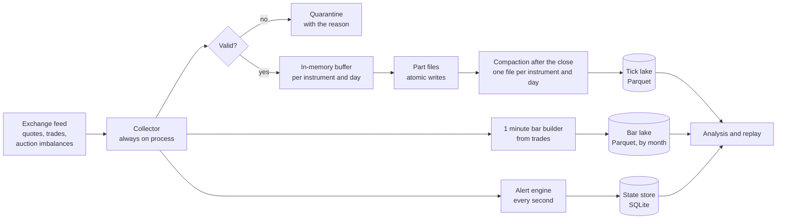
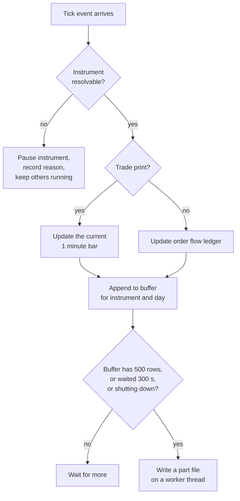
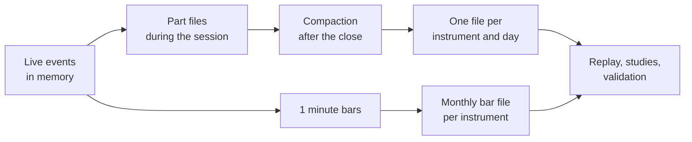

# 8. The data pipeline behind the original system

The three models in this repository were first run inside a live market data
system. This page describes that system's pipeline: what it took in, at what rates
and time scales, how it kept data flowing without interruption, how it guarded
against bad, duplicated or leaked data, and how it kept storage small. Most design
decisions trace to a specific failure, and the failure is named. Every figure is
measured from the system's own storage and logs.

## Terms used on this page

| Term | Meaning |
|:--|:--|
| **Tick event** | One message from the exchange feed: either a quote update (the best bid or ask price or size changed) or a trade print (shares changed hands at a price). Each carries a millisecond timestamp. |
| **Session** | One trading day. The regular session runs 09:30 to 16:00 US Eastern time (6.5 hours); the collector also recorded the extended hours before and after. |
| **Live session** | A trading day on which the collector ran and recorded the live feed. |
| **Auction imbalance message** | Before the opening and closing auctions, the exchange publishes how many shares of buy or sell orders are still unmatched at the reference price. These notices are only available live: a missed one can never be downloaded later. |
| **Bar** | A summary of one time interval (here one minute or one day): open, high, low, close and volume. |
| **Data lake** | A folder of plain columnar files organised by date and instrument, read directly by analysis code, instead of a database server. |
| **Part file / compaction** | Small files written during the day, merged into one file per instrument and day after the close. |

## Scale, and over what period

| Layer | Volume | Period |
|:--|--:|:--|
| Live tick events (quotes and trades) | **83,966,153** | 21 live sessions between 17 Aug and 25 Sep 2026 |
| Busiest live session | 6,428,095 events | 23 Sep 2026 |
| Average live session | about 4.0 million events | |
| Instruments streamed live | 44 (41 at a time) | |
| One minute bars (history backfill plus live) | **58,742,809** for 388 instruments | Apr 2025 to Sep 2026, about 18 months |
| Daily bars | 9,641 for 42 instruments | Aug 2025 to Sep 2026 |
| Auction imbalance messages | 345,814 | the live sessions |
| Compressed columnar storage | 1.08 GB ticks, 1.66 GB bars | |
| Alert events recorded | 32,074, each with 37 fields | |
| Graded alert outcomes | 187,352 | |
| Model fits recorded | 672 | |

## Time scales, from milliseconds to months

| Time scale | What lives there |
|:--|:--|
| Milliseconds | Every tick event, timestamped to the millisecond as it arrives. |
| Sub-second | The order flow ledger: cumulative order flow imbalance and book depth updated on every quote change, so any window's value is two binary searches. |
| 1 second | The live alert engine re-reads each instrument's recent events once per second. |
| 1 minute | Bars built from trades in real time; the unit the level models use. |
| Minutes to hours | Every alert graded at 1, 2, 5, 10, 20 and 30 minutes after it fired. |
| Daily | End-of-day bars, the post close backfill job, and the day partition of the lake. |
| Monthly | Bar files. |

**Throughput.** The busiest session averaged about 275 events per second across the
6.5 hour regular session (6.43 million events), with bursts well above that at the
open. A sampled health record from a full session: event loop lag 0.5 ms median and
49 ms worst over a 60 second window, 4.41 million rows written that day, 404 MB of
memory.

## Architecture

## Continuous flow without interruption

The collector's job is to never miss the live feed, because auction messages cannot
be recovered later. Five choices serve that.

1. **Collection is its own always on process.** The user interface can be restarted,
   crash or be closed without touching collection. The operating system's service
   manager keeps the collector alive; it idles outside market hours.
2. **Nothing slow runs where events arrive.** Writing to disk happens on a worker
   thread; the loop that receives events only appends to memory. This came from a
   measured failure: a whole-file rewrite at each minute boundary (43 ms median,
   152 ms worst, per instrument) and database commits on the same loop made the live
   view fall 13 to 28 seconds behind.
3. **Reconnect with backoff.** A dropped feed connection is retried with an
   increasing delay instead of a tight loop, and every reconnect is counted and shown.
4. **One bad instrument never stops the rest.** An instrument the feed cannot resolve
   (a typo, a delisting) is paused with the reason; every other instrument keeps
   flowing. Before this, one typo stopped half the collector.
5. **A second copy refuses to start.** Two copies competing for the same feed
   connection once restarted each other for half an hour.

What happens to each incoming event:

## Safeguards against bad, duplicated or leaked data

| Risk | Safeguard |
|:--|:--|
| **Half-written files** after a crash | Every file is written to a temporary name in the same folder and then renamed into place in one step, so a reader sees either the old file or the complete new one. |
| **Two writers colliding** on the same file | Each writer stamps its part files with its own token; compaction merges them all. |
| **Duplicate records** | Compaction merges the day's part files with any existing final file and sorts by timestamp; running it twice changes nothing. The bar builder updates the bar for a minute in place rather than adding a second row, and a restart reads the month's existing bars before continuing. A month-boundary bug that wrote duplicate bars into two files was found and fixed. |
| **Malformed values** | Loaders reject impossible rows (high below low, nonpositive prices, time going backwards) with the reason and keep the rest; tracebench's loader applies the same rule. |
| **Corrupted state database** | On first connect, an integrity check runs; a damaged file is moved aside (never deleted) and rebuilt with SQLite's recovery tool. This happened once, after an operating-system upgrade. |
| **Leakage of the future into analysis** | Features for every recorded alert are computed only from data at or before its own millisecond; models are split by trading day (train, validation, untouched test); replay is tested so that changing the future never changes a past prediction (SYS-1). |
| **Tests touching real data** | The test suite runs against a throwaway data folder by default, so no test can read or write the live store. |
| **Time-zone errors** | Everything is stored in UTC; every scheduled job names its time zone. An end of day job once fired an hour late because it used the machine's zone. |
| **Schema drift** | Record types written to the lake are treated as contracts: fields are never added to a type already on disk. |

## Keeping storage small

1. **Columnar, compressed files (Parquet).** 84 million tick events take about 1 GB;
   58.7 million bars take 1.7 GB.
2. **Partitioning by instrument and date.** Analysis reads only the files it needs,
   and a finished day never changes again.
3. **Compaction.** Writing every buffer on every cycle once produced 26,444 part files
   for one session (median 3.2 KB, mostly per-file overhead), and the growing file
   count slowed each write cycle from 3.2 to 17.1 seconds. Two changes fixed it: a
   buffer is only written once it holds 500 rows or has waited 300 seconds, and after
   the close all part files are merged. The same day then took 39 files.
4. **Visible data lifecycle.** Size, days and file count per instrument are shown,
   and data for an instrument can be purged deliberately (typed confirmation, files
   and rows together).
5. **Memory caps.** The embedded analytics engine defaults to most of the machine's
   memory; it is capped, and each process's memory is shown.

The life of one day's data:

## Monitoring

One heartbeat record, written every minute and checked by the application: its age,
event loop lag (median and worst), rows written, flush and bar-write durations, feed
connection state and reconnect count, and memory. A green test suite was once
reported while the system had been stopped for 20 minutes; since then, "working"
requires these live signals, not only passing tests.
